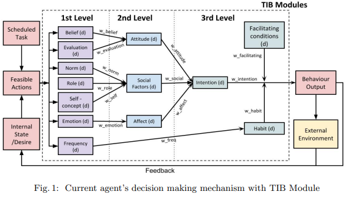
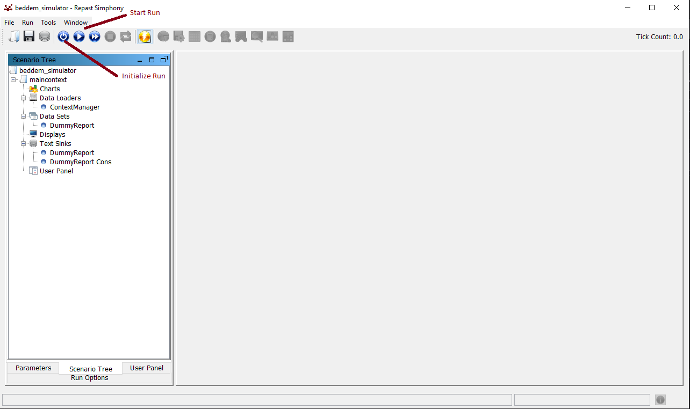

# Behavior-driven Demand Model (BedDeM)
Behavior-driven Demand Model using Repast Simphony as a base framework library implementing the Triandis' Theory of Interpersonal Behavior.



## Run individual simulation
For simulation run the repast simphony and corresponding eclipse version has to be installed. Installing Repast Simphony and compatible `eclipse committers IDE (2022-06)` can be done via the official instruction page [here](https://repast.github.io/download.html) or following the steps desribed bellow.

1. Install [Eclipse IDE for Eclipse Committers 2022-06](https://www.eclipse.org/downloads/packages/release/2022-06/r/eclipse-ide-eclipse-committers) for desired platform.
2. **Install Groovy for Eclipse:** Depending on the version of eclipse add the source URL from [here](https://github.com/groovy/groovy-eclipse/wiki). For Example in eclipse version 2022-06: 
     - Help -> Install New Software -> Add new repository ->  `https://groovy.jfrog.io/artifactory/plugins-release/e4.24` -> Main package -> Eclipse Groovy Development tools
3. **Install Repast Simphony for Eclipse:**
    - Help -> Install New Software -> Add new repository -> `https://web.cels.anl.gov/projects/Repast/update_site` -> Repast Simphony > Install package
4. Check Groovy compiler version is higher than 3.0.x:
    - Window -> Preferences -> Groovy compiler
5. **Note**: If `Surrogate issue UTF16 appears`
    - Menu Window -> Preferences -> Java -> Mark occurences -> Untick
6. **Install openjdk-11** from [here](https://jdk.java.net/archive/):
    - Preferences -> Installed JREs -> Pick folder
    - Preferences -> Java -> Compiler-> Java 11
7. **Clone the beddem_simulator repository**: `git clone https://github.com/SiLab-group/beddem_simulator.git`
8. **Import project to eclipse**:
    - File -> New -> Other -> Repast Simphony -> Repast Simphony Project -> Select the folder of cloned repo (beddem) -> Name the project beddem -> Finish
9. Repast parameters, context, scenarios should be stored in `beddem_simulator.rs` folder. If you name project differently it is needed to copy the xml files or in `Repast.settings`.
10. Start Repast interface by click the small arrow next to the run button and select "your_project_name Model" in default case `beddem_simulator Model`.
11. Click the `Initialize and run button` to run the project. These buttons are shown in the example simulation run bellow. After it finishes, you should see a new output file in the output folder.
 
## Build with ant
1. Install ant depending on the OS.(Ubuntu: `sudo apt-get install ant`)
2. Adjust the path of ECLIPSE_HOME in the build.xml or run `ant build -DECLIPSE_HOME=/your/path/to/plugins`
3. Run model `ant run-model -DECLIPSE_HOME=/your/path/to/plugins`

## Example simulation run
 This example simulation contains one agent with the simple schedule of two tasks. When changing the weight of the `time_weight` or `cost_weight` in the `agent.csv` file. 
 The output changes based on the agent priorities (`weights`). When the cost is more important agent walks at `6am`, when the time is more important agent drives to save the time.
 This properties can be adjusted in the example csv files located in the `data` folder.
 1. The properties file in `data/beddem_simulator.properties` should contain the files to be parsed
 
```bash
AgentCSVfile=agent
LocationCSVfile=location
ScheduleCSVfile=schedule
VehicleCSVfile=vehicle
```
2. Run the simulation with run green button `beddem_simulator Model`
3. This opens Repast Simphony UI. Initialize context with `Initialize run` button.
4. Run the simulation with `Start Run` button.

5. Output files should be created in the root folder and the output should be print into the console. Such as 

```bash
printReport: "
agentID,start_time,km,vehicle
1,6.0,2.0,car
1,12.0,10.0,car
"
```
This output corresponds to the `time_weight` set to 5 and `cost_weight` set to 1.

## Project structure
In this case we have example `<scenario>` called `dummy`. The directory structure:
* **`src`**
	- `<scenario>.agent`: specific implementation of all agents for scenario and external inputs for processing
	   + CommunicationComponent: decision communication
	   + DecisionComponent: decision determinants definition
	   + MemoryComponent: memory definition and feelings
	   + PerceptionComponent: perception component of possibilities
	   + StandardDummyAgent: definition of the agent and its functions
	- `<scenario>.concept`: basic concepts used around model such as Task and Option available for agent
	   + EnvironmentalState: state of the environment and availability
	   + Feedback: feedback of the environment
	   + InternalState: state of the environment
	   + Option: environment options
	   + Task: one task in the agent schedule with all its constraints
	   + Vehicle: vehicle definition and properties
	- `<scenario>.context`: context definitions usually taken from the GlobVariables file
	   + AgentContext: context definition for agent
	   + LocationContext: context definition for location
	- `<scenario>.database`: data retrievers
	   + CSVReader: reader for csv files
	- `<scenario>.environment`: definitions of the environment
	- `<scenario>.report`: contains scenario specific reporter classes.
		+ Reporter classes: describes how what we want from the model. We can select which method to be run in Repast interface.
	- `<scenario>.simulator`: contain the Repast controller, scheduler and logger of the project. This is the core function of Repast and you should not modify it. The two simulator classes here are ContextManager (the simulator controller and entry points of the simulator) and ThreadAgentScheduler (schedules the Tasks and execute them).
		+ ContextManager: describes how the input should be read and can be modified to fit the project. Container of all the agents and locations.
	- `framework.agent.core`: anything that is related to the agent's operation
		+ IAgent: the Interface of agent. Contains some methods that an agent should have. 
		+ DefaultAgent: the standard agent that can be extended depend on the type of project. Its simulator operation is described in the step() method which is controlled by the Scheduler mentioned above.
		+ StandardTraveller: the class used specific for transportation demand. Contains the logic to evaluate an option. 
	- `framework.agent.reasoning`: containing the TPB and TIB model and determinant interfaces
		+ Determinant: standard determinant for evaluation of options
		+ LeafDeterminant: base determinant node in decision making 
		+ ParentDeterminant: parent determinant in decision making model defines ranking options
		+ TIBModel: Triandis decision making model, definition all base determinants according to this model
		+ TPBModel: Theory of planned behavior model
	- `framework.concept`: some basic concepts that are used around the model (i.e Task and Option available for the agent). Note that at the moment time is setup as hour and distance is in km. Also some classes that are implemented specifically for transportation demand.
	    + EnvironmentalState: state of environment
	    + Feedback: interface definition of feedback
	    + InternalState: interface for agent state 
	    + Opinion: interface for agent opinion
	    + Option: option interface
	    + Task: task interface
	- `framework.environment`: information of the environment where the agents reside in. (ex: available transportations, total demand, kms, spending for each mode, etc.).
	    + Environment: interface for location of the agent its environment
	- `framework.exception`: all the exceptions and how to handle them.
	
* **`data`**
	- `csv_files`: two scenario example files one with `dummy` prefix and one without. Both are containing schedule for only for next day.
		+ agents: list of all the agent and their parameters.
		+ vehicle: list of all available transportation mode and their parameters.
		+ schedule: list of all the events to be assigned to agents. At the moment, the price point of car is added at the end of the file name (ex: 0.0 mean car_price * 0.0). This is for when we want to run in batch mode where we want to define different price points in the demand curve.
		+ location: list of all locations with available modes of transport
	- testing: csv files for modular + system testing, will be generated if you run the testing classes.
	- beddem_simulator.properties: locations of all the inputs, parameters and outputs of the model.
* **`your_project_name.rs`**: Define the inputs, outputs, parameters and observers for the model


## Tested with versions
	- Eclipse: 2024-03
	- Repast Simphony: 2.10
	- Groovy: 4.31 (2024-03) https://groovy.jfrog.io/artifactory/plugins-snapshot/e4.31
	- Ant: 1.10.12
