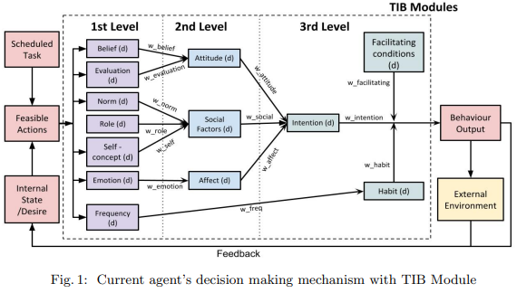
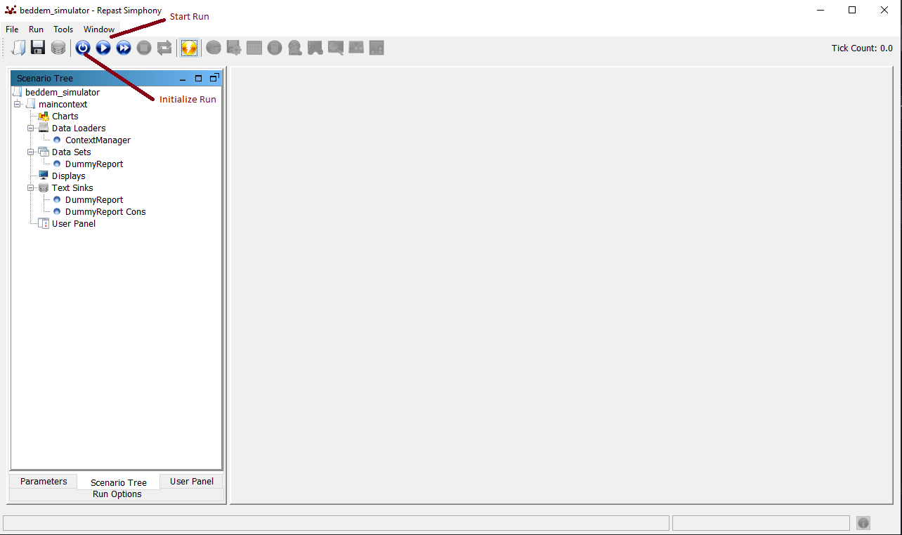

# Behavior-driven Demand Modelling framework (BedDeM framework)
Behavior-driven Demand Model using Repast Simphony as a base framework library implementing the Triandis' Theory of Interpersonal Behavior.



## Run individual simulation
For simulation run the repast simphony and corresponding eclipse version has to be installed. Installing Repast Simphony and compatible `eclipse committers IDE (2022-06)` can be done via the official instruction page [here](https://repast.github.io/download.html) or following the steps desribed bellow.

1. Install [Eclipse IDE for Eclipse Committers 2022-06](https://www.eclipse.org/downloads/packages/release/2022-06/r/eclipse-ide-eclipse-committers) for desired platform.
2. **Install Groovy for Eclipse:** Depending on the version of eclipse add the source URL from [here](https://github.com/groovy/groovy-eclipse/wiki). For Example in eclipse version 2022-06: 
     - Help -> Install New Software -> Add new repository ->  `https://groovy.jfrog.io/artifactory/plugins-release/e4.24` -> Main package -> Eclipse Groovy Development tools
3. **Install Repast Simphony for Eclipse:**
    - Help -> Install New Software -> Add new repository -> `https://web.cels.anl.gov/projects/Repast/update_site` -> Repast Simphony > Install package
4. Check Groovy compiler version is higher than 3.0.x:
    - Window -> Preferences -> Groovy compiler
5. **Note**: If `Surrogate issue UTF16 appears`
    - Menu Window -> Preferences -> Java -> Editor -> Mark occurences -> Untick
6. **Install openjdk-11** from [here](https://jdk.java.net/archive/):
    - Window -> Preferences -> Java -> Installed JREs -> Pick folder
    - Window -> Preferences -> Java -> Compiler-> Java 11
7. **Clone the beddem_simulator repository**: `git clone https://github.com/SiLab-group/beddem_simulator.git`
8. **Import project to eclipse**:
    - File -> New -> Other -> Repast Simphony -> Repast Simphony Project -> Select the folder of cloned repo (beddem) -> Name the project beddem -> Finish
9. Repast parameters, context, scenarios should be stored in `beddem_simulator.rs` folder. If you name project differently it is needed to copy the xml files or in `Repast.settings`.
10. Start Repast interface by click the small arrow next to the run button and select "your_project_name Model" in default case `beddem_simulator Model`.
11. Click the `Initialize and run button` to run the project. These buttons are shown in the example simulation run bellow. After it finishes, you should see a new output file in the output folder.
 
## Build and run with ant
1. Install ant depending on the OS.(Ubuntu: `sudo apt-get install ant`)
2. Adjust the path of ECLIPSE_HOME in the build.xml or run `ant build "-DECLIPSE_HOME=/your/path/to/eclipse"`
3. Run model `ant run-model "-DECLIPSE_HOME=/your/path/to/eclipse/"`
4. Runt tests with ant `ant run-test "-DECLIPSE_HOME=/your/path/to/eclipse/"`

## Example simulation run
 This example simulation contains one agent with the simple schedule of two tasks. When changing the weight of the `time_weight` or `cost_weight` in the `agent.csv` file. 
 The output changes based on the agent priorities (`weights`). When the cost is more important agent walks at `6am`, when the time is more important agent drives to save the time.
 This properties can be adjusted in the example csv files located in the `data` folder.
 1. The properties file in `data/beddem_simulator.properties` should contain the files to be parsed
 
```bash
AgentCSVfile=agent
LocationCSVfile=location
ScheduleCSVfile=schedule
VehicleCSVfile=vehicle
```
2. Run the simulation with run green button `beddem_simulator Model`
3. This opens Repast Simphony UI. Initialize context with `Initialize run` button.
4. Run the simulation with `Start Run` button.

5. Output files should be created in the root folder and the output should be print into the console. Such as 

```bash
printReport: "
agentID,start_time,km,vehicle
1,6.0,2.0,car
1,12.0,10.0,car
"
```
This output corresponds to the `time_weight` set to 5 and `cost_weight` set to 1.

## Scenario: Sion ↔ Sierre
The bundled scenario models a full TIB decision with **two locations** — Sion (`loc_id 1`) and Sierre (`loc_id 2`), both offering train + bus — and several agents with different attributes (weights and owned vehicles). Every TIB determinant is implemented in `StandardDummyAgent` (norm, role, self-concept, emotion, facilitating, habit, plus time/cost), each expressed as a **cost** (lower = better), so an agent picks the option with the lowest expected utility.

Everything is data-driven from `data/`:
- `agent.csv` — one row per agent: home location, funding, owned vehicles (`resources`), and the TIB weights.
- `location.csv` — `loc_id, train, bus, tram, name` (which transit each location offers).
- `schedule.0.csv` — the trips (`agent_id, start, km, time_limit, purpose`); a Sion↔Sierre trip is an 18 km row.
- `vehicle.csv` — the modes and their speed/cost.

Add agents, locations, or trips by editing those CSVs — the `ContextManager` loads them at startup. To see each determinant's score per mode, enable `dummy.agent.StandardDummyAgent = DEBUG` in `MessageCenter.log4j.properties`.

## Tested with versions
	- Eclipse: 2024-03
	- Repast Simphony: 2.10
	- Groovy: 4.31 (2024-03) https://groovy.jfrog.io/artifactory/plugins-snapshot/e4.31
	- Ant: 1.10.12

## Enable debug log
To enable the debug logging for the BedDeM specific classes add or uncomment in the
`MessageCenter.log4j.properties`. For example to enable debug output to the console and to the debug.log file for the `CSVReader.class` add following:

```bash
log4j.logger.dummy.database.CSVReader = DEBUG, stdout, R
```
